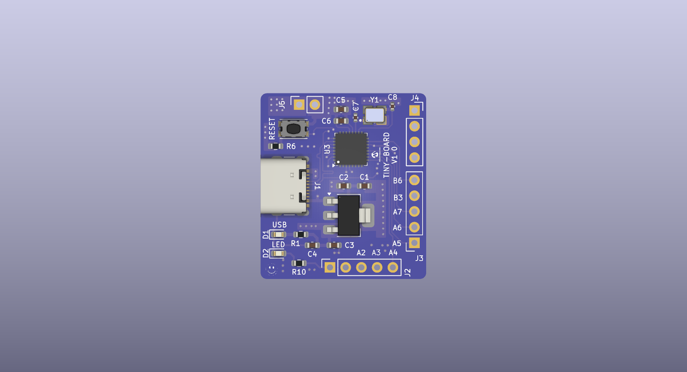

<h1>Tiny Board: ATTiny87-M based dev board</h1>

  

---

## Hardware
- Flash Program Memory:	8 KB
- SRAM (RAM):	512 bytes
- EEPROM:	512 bytes
- Maximum Clock Speed:	16 MHz
- CPU Architecture:	AVR 8-bit RISC
- GPIO Pins: 10
- I2C: 1
- SPI: 1
- Dimension: 26.75mm x 28.025mm
